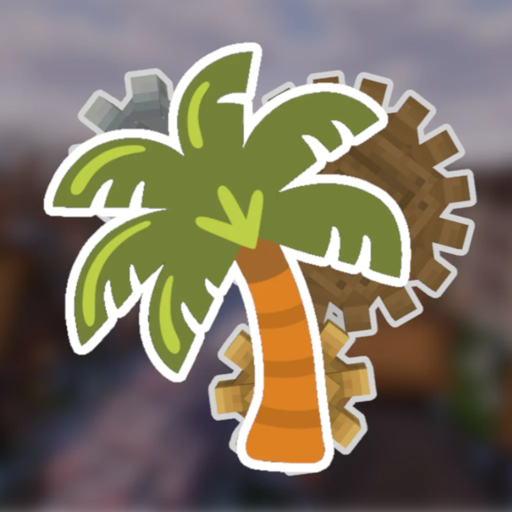

# koconutmc.com Website



This project is the front-end source code for the Koconut MC modpack and Koconut SMP.
<br></br>
<br></br>

## Development

Prerequisite: a node package manager such as [npm](https://www.npmjs.com/)

```sh
cd website
npm install
```

### For development:

```sh
npm run dev
```

### For production testing:

```sh
npm run build
npm run preview # start a web server for TESTING purposes
```

## Deployment

### This is the recommended way for production use.

Prerequisites: docker and docker-compose

A [docker-compose.yml](docker-compose.yml) is provided by the project for easy deployment. The compose stack uses [crafatar](https://github.com/crafatar/crafatar) API to retrieve player avatar images, the API also requires [redis](https://redis.io/).

### Deploying the compose manually:

```sh
cd website
mkdir modpack # the volume that holds large sized modpack files for downloading off the web
docker compose up -d --build
```

#### License

<sup>
Licensed under <a href="LICENSE">LGPL-3.0 License</a>.
</sup>
